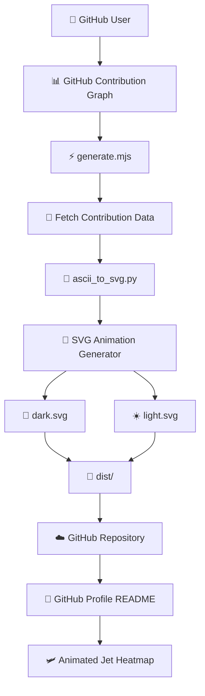
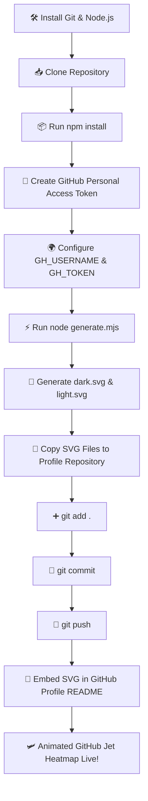

<div align="center">

# 🛩️ GitHub Jet Heatmap

### Generate a Beautiful Animated GitHub Contribution Heatmap for Your Profile


</div>

## ⚡ Turn Your GitHub Contribution Graph into an Animated Jet Heatmap

Transform your ordinary GitHub contribution graph into a **beautiful animated Jet Heatmap** that brings your profile to life.
Powered by **Node.js**, **SVG animations**, and **GitHub Actions**, this project automatically generates an animated heatmap from your GitHub contributions and keeps it updated with every new commit.
Whether you're a developer, student, open-source contributor, or portfolio enthusiast, **GitHub Jet Heatmap** adds a modern and professional touch to your GitHub profile.

<br>

<p align="center">
  
</p>

---
# 📖 Introduction

GitHub's default contribution graph is static and simple.
This project transforms that contribution graph into a **beautiful animated Jet Heatmap**, making your GitHub profile stand out with smooth SVG animations that automatically adapt to the visitor's preferred light or dark theme.
Instead of displaying a traditional contribution calendar, the generated SVG showcases your coding activity through dynamic animations that can be embedded directly into your GitHub Profile README.
The entire generation process is automated, allowing your heatmap to stay synchronized with your latest GitHub contributions with minimal effort.
Whether you're building a portfolio, showcasing open-source activity, or simply enhancing your profile, GitHub Jet Heatmap offers a clean, modern, and visually engaging solution.

---
# ✨ Features

- 🛩️ Beautiful animated Jet Heatmap
- 🎨 Automatic Light & Dark theme support
- ⚡ Smooth SVG animations
- 📈 Visualizes your real GitHub contributions
- 🔄 Automatic updates using GitHub Actions
- 💻 Cross-platform support
- 🚀 Lightweight and fast
- 📦 Easy to set up
- 🔧 Beginner-friendly installation
- 🌐 Fully responsive SVG output
- 🎯 Perfect for GitHub Profile READMEs
- 🛡️ Secure GitHub Personal Access Token integration
- 📂 Clean project structure
- ❤️ Open Source and MIT Licensed
---
# 🏗️ Project Architecture

```text
GitHub-Jet-Heatmap/
│
├── .github/
│   └── workflows/
│       └── jet-heatmap.yml          # GitHub Actions workflow for automatic updates
│
├── dist/                            # Generated SVG output
│   ├── github-jet.svg
│ 
│
├── ascii_to_svg.py                  # Converts ASCII contribution data into SVG
├── generate.mjs                     # Main script that generates the animated Jet Heatmap
├── preview-test.mjs                 # Preview and testing script
├── update.py                        # Utility script for updates
│
├── dark.svg                         # Generated Dark Theme SVG
├── light.svg                        # Generated Light Theme SVG
├── preview-sample.svg               # Sample preview animation
│
├── package.json                     # Project metadata & dependencies
├── package-lock.json                # Locked dependency versions
│
├── README.md                        # Project documentation
├── LICENSE                          # Project License (optional)
│
└── .gitignore                       # Ignored files (recommended)
```

---

## ⚙️ How the Project Works



---

## 📂 Directory Overview

| File / Folder | Description |
|---------------|-------------|
| `.github/workflows/jet-heatmap.yml` | Automates SVG generation using GitHub Actions |
| `dist/` | Stores the generated SVG files |
| `ascii_to_svg.py` | Converts contribution data into SVG graphics |
| `generate.mjs` | Main entry point for generating the Jet Heatmap |
| `preview-test.mjs` | Used for previewing and testing animations |
| `update.py` | Helper script for update-related tasks |
| `dark.svg` | Animated dark theme output |
| `light.svg` | Animated light theme output |
| `preview-sample.svg` | Sample output for demonstration |
| `package.json` | Node.js project configuration |
| `package-lock.json` | Dependency lock file |
| `README.md` | Documentation for the project |

---

# 🚀 Getting Started

Follow these steps to generate your own animated GitHub Jet Heatmap and add it to your GitHub Profile README.

## 📋 Prerequisites

Before you begin, ensure you have the following installed:
- Git
- Node.js (v18 or later recommended)
- npm (comes with Node.js)
- A GitHub account
- A GitHub Profile Repository
- A GitHub Personal Access Token (PAT)

**Tip:** Download the latest LTS version of Node.js for the best compatibility.

## 📥 Step 1: Clone the Repository

Clone this repository to your local machine:
```bash
git clone https://github.com/LoganthP/github-jet-heatmap.git
```
Then navigate into the directory:
```bash
cd github-jet-heatmap
```

## 📦 Step 2: Install Dependencies
Install all required packages:
```bash
npm install
```
This command installs every dependency listed in `package.json`.

## 🔑 Step 3: Create a GitHub Personal Access Token (PAT)
The generator requires a GitHub token to fetch your contribution graph.
Navigate to:
1. GitHub → Settings → Developer Settings → Personal Access Tokens → Tokens (Classic)
2. Click "Generate New Token"
3. Grant only the following permissions:
   - ✅ `read:user`
   - ✅ `public_repo` (for public repositories)
   - ✅ `repo` (only if your profile repository is private)
4. Do not grant unnecessary permissions such as:
   - `delete_repo`
   - `workflow`
   - `admin:org`
   - `packages`
5. After creating the token, copy it immediately. GitHub will not display it again.

## 🌍 Step 4: Configure Environment Variables
Windows (PowerShell)
```bash
$env:GH_USERNAME="YOUR_GITHUB_USERNAME"
$env:GH_TOKEN="YOUR_GITHUB_PAT"
```
Example:
```bash
$env:GH_USERNAME="LoganthP"
$env:GH_TOKEN="ghp_xxxxxxxxxxxxxxxxx"
```
macOS / Linux
```bash
export GH_USERNAME="YOUR_GITHUB_USERNAME"
export GH_TOKEN="YOUR_GITHUB_PAT"
```
Or
```bash
GH_USERNAME="YOUR_GITHUB_USERNAME" GH_TOKEN="YOUR_GITHUB_PAT" node generate.mjs
```

## ⚡ Step 5: Generate the Animation

Run the generator:
```bash
node generate.mjs
```
The script will:
- Connect to GitHub
- Fetch your contribution graph
- Generate the animated SVG
- Save it locally

## 📁 Step 6: Verify the Generated Files

After a successful run, you'll find the generated animation.
Depending on the version of the project, it may generate:
```text
dark.svg
light.svg
```
or
```text
dist/
└── github-jet.svg
```
Open the SVG in your browser to preview the animation.

## ☁️ Step 7: Add the SVG to Your GitHub Profile Repository

Copy the generated SVG into your GitHub Profile Repository.

Example:
```text
LoganthP/

├── README.md
├── github-jet.svg
```
Your profile repository must have the same name as your GitHub username.

Example:
```bash
https://github.com/LoganthP/LoganthP
```
## 📤 Step 8: Commit and Push
```bash
git add .
git commit -m "Add GitHub Jet Heatmap"
git push
```
---

# 🤖 Configure GitHub Actions

The repository includes a preconfigured GitHub Actions workflow that automatically regenerates your Jet Heatmap on a scheduled basis.

## Step 1 — Open the Actions Tab

Navigate to your repository and click the **Actions** tab.

```
Repository
    └── Actions
```

If prompted, click **I understand my workflows, go ahead and enable them**.

---

## Step 2 — Enable Workflow Permissions

Open

```
Settings
    ↓
Actions
    ↓
General
```

Scroll to **Workflow permissions**.

Select

```
✅ Read and write permissions
```

Click

```
Save
```

> **⚠️ Important**
>
> Without enabling **Read and write permissions**, GitHub Actions cannot commit the generated SVG back to your repository.

---

## Step 3 — Run the Workflow

Open

```
Actions
```

Select

```
Update Jet Heatmap SVG
```

Click

```
Run workflow
```

Choose the **main** branch and click **Run workflow**.

Wait for approximately **30–60 seconds**.

---

## Step 4 — Verify the Generated Files

Once the workflow completes successfully, the generated SVG files will appear inside the `dist` directory.

```
dist/
├── dark.svg
└── light.svg
```

---

## Step 5 — Confirm the Raw SVG URL

Open the generated SVG file and click **Raw**.

The URL should look similar to:

```text
https://raw.githubusercontent.com/YOUR_USERNAME/YOUR_REPOSITORY/main/dist/dark.svg
```

or

```text
https://raw.githubusercontent.com/YOUR_USERNAME/YOUR_REPOSITORY/main/dist/light.svg
```

If the SVG opens successfully in your browser, the generation process is working correctly.

---

## Step 6 — Embed the SVG in Your Profile README

Add the following snippet to your GitHub Profile README.

```html
<p align="center">
<picture>

<source
    media="(prefers-color-scheme: dark)"
    srcset="https://raw.githubusercontent.com/YOUR_USERNAME/YOUR_REPOSITORY/main/dist/dark.svg">

<source
    media="(prefers-color-scheme: light)"
    srcset="https://raw.githubusercontent.com/YOUR_USERNAME/YOUR_REPOSITORY/main/dist/light.svg">


</picture>
</p>
```

Replace:

- `YOUR_USERNAME`
- `YOUR_REPOSITORY`

with your own GitHub username and repository name.

---

## ✅ Success

After pushing your changes, your GitHub Profile README will automatically display the animated **Jet Heatmap**.
Whenever the GitHub Actions workflow runs, the SVG files will be regenerated automatically, ensuring your profile always reflects your latest GitHub contributions.

---
## 🛩️ Step 9: Add the Animation to Your README
If your project generates github-jet.svg

```bash
<p align="center">
  
</p>
```

Replace YOUR_USERNAME with your GitHub username.

Example:
```bash
https://raw.githubusercontent.com/LoganthP/JetCommit/main/dist/github-jet.svg
```

If your project generates dark.svg and light.svg

```bash
<p align="center">
<picture>

<source media="(prefers-color-scheme: dark)"
srcset="https://raw.githubusercontent.com/YOUR_USERNAME/YOUR_USERNAME/main/dark.svg">

<source media="(prefers-color-scheme: light)"
srcset="https://raw.githubusercontent.com/YOUR_USERNAME/YOUR_USERNAME/main/light.svg">


</picture>
</p>
```
---

## 🎉 Final Result

After committing and pushing your changes, visit your GitHub profile.
Your animated Jet Heatmap will now appear automatically in your profile README.

## 📊 Workflow Overview


